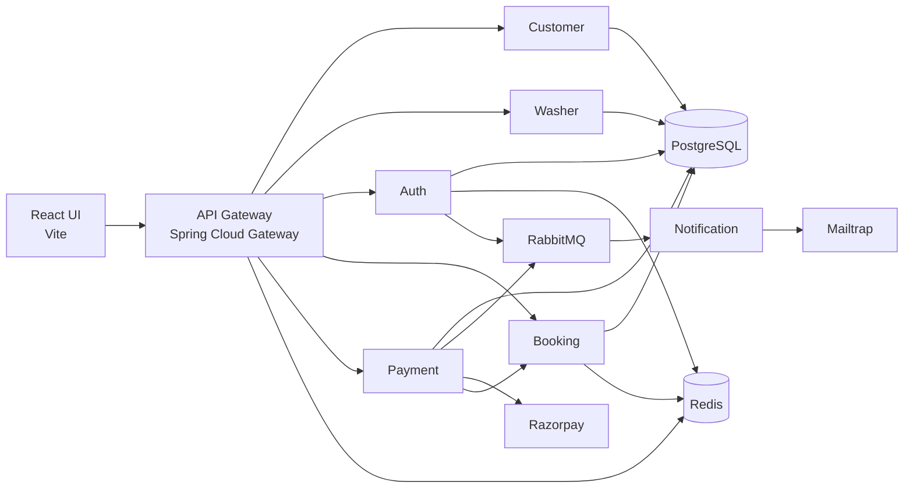

# WashFlow - On-Demand Service Platform

Spring Boot microservices booking platform for car wash discovery, slot booking, Razorpay test payments, email notifications, and admin operations.


The project is designed as a backend-heavy system with a lightweight React/Vite UI for local demos and walkthroughs.

## Highlights

- Seven-service microservice architecture with API Gateway as the public entry point.
- JWT authentication with Redis-backed session validation for logout/session control.
- Role-based access for customer, washer, and admin flows.
- Redis slot availability and temporary checkout locks to prevent double booking.
- Razorpay test mode integration with server-owned pricing and payment verification.
- RabbitMQ-driven notification flow using Mailtrap for email verification and payment emails.
- Gateway-level rate limiting, circuit breakers, CORS, internal API blocking, and trusted identity header injection.
- Lightweight React/Vite UI for demonstrating customer booking, profile/vehicles, washer actions, and admin views.

## Architecture




## Tech Stack

| Area | Technology |
| --- | --- |
| Backend | Java, Spring Boot, Spring Security, Spring Cloud Gateway |
| Frontend | React, Vite |
| Database | PostgreSQL |
| Cache/locking/session | Redis |
| Messaging | RabbitMQ |
| Payment | Razorpay test mode |
| Email | Mailtrap SMTP |
| Resilience | Rate limiting, circuit breakers, local JWT validation, Redis session validation |
| Tooling | Maven, PowerShell scripts |

## Services

| Service | Port | Responsibility |
| --- | --- | --- |
| `api-gateway` | `8080` | Public entry point, JWT validation, Redis session validation, role-based routing, identity header injection, rate limiting, circuit breakers, internal API blocking |
| `auth-service` | `8081` | User registration/login/logout, JWT creation, email verification token flow, Redis sessions, auth events |
| `customer-service` | `8082` | Customer profile and vehicle management |
| `washer-service` | `8083` | Washer profile, service area lookup, availability, ratings |
| `booking-service` | `8084` | Rolling slot generation, Redis slot availability, slot locking, booking confirmation, booking completion, booking validation |
| `payment-service` | `8085` | Razorpay order creation, payment verification, webhook handling, booking confirmation after payment |
| `notification-service` | `8086` | RabbitMQ event consumer and Mailtrap email sender |
| `carwash-ui` | `5173` | Lightweight demo UI for customer, washer, and admin flows |

Each backend service has its own `SERVICE_OVERVIEW.md` with API details and service-specific flow notes.

## Database Ownership

Each domain service owns its own PostgreSQL database. Services do not directly read or write another service's tables; cross-service workflows go through APIs, gateway-routed calls, or RabbitMQ events.

| Service | Owned Database | Main Data |
| --- | --- | --- |
| `auth-service` | `carwash_auth_db` | Users, roles, verification state |
| `customer-service` | `carwash_customer_db` | Customer profiles and vehicles |
| `washer-service` | `carwash_washer_db` | Washer profiles, service areas, ratings |
| `booking-service` | `carwash_booking_db` | Slots and bookings |
| `payment-service` | `carwash_payment_db` | Payment orders, Razorpay references, payment status |
| `notification-service` | None currently | Stateless RabbitMQ consumer and email sender |
| `api-gateway` | None | Stateless routing/security boundary; uses Redis for session/rate-limit checks |

## Main Flows

### Authentication And Email Verification

1. User registers as `CUSTOMER` or `WASHER`.
2. Auth-service creates an email verification token and stores only a SHA-256 token hash in Redis with a 3-hour TTL.
3. Auth-service publishes an email event to RabbitMQ.
4. Notification-service sends the verification email through Mailtrap.
5. User opens the verification link.
6. Auth-service marks the account as verified.
7. Verified users can login and receive a JWT.
8. Gateway validates JWT signature and checks the active Redis session on every protected request.

### Booking And Slot Locking

1. Customer searches washers by area and pincode.
2. Booking-service exposes slots for today, tomorrow, and the day after tomorrow.
3. Same-day slots require at least 1 hour lead time.
4. When customer pays, the UI locks the selected slot through booking-service.
5. Booking-service removes the slot from Redis availability and creates a customer-owned lock with a 10-minute TTL.
6. If checkout is cancelled, the UI releases the temporary lock.
7. If payment succeeds, payment-service confirms the slot internally and booking-service marks the slot as booked.

### Payment

1. UI starts payment through payment-service.
2. Payment-service validates the customer-owned slot lock with booking-service.
3. Payment-service creates a Razorpay test order using server-owned price data.
4. UI opens Razorpay Checkout.
5. UI submits Razorpay payment id/order id/signature to payment-service.
6. Payment-service verifies the signature, marks payment success, confirms booking, and publishes notification event.

### Notification

1. Auth-service publishes verification email events.
2. Payment-service publishes payment success events.
3. Notification-service consumes RabbitMQ events.
4. Notification-service sends emails through Mailtrap.

## Important Design Choices

- **JWT + Redis session validation:** JWTs are locally validated for speed, while Redis session state allows logout and single-session enforcement at the gateway.
- **Gateway-owned identity headers:** Public clients cannot send trusted identity headers. Gateway strips incoming identity headers and rebuilds them from JWT claims.
- **Database ownership per service:** Each domain service owns its PostgreSQL schema/database, so service boundaries are enforced at the data layer.
- **Internal API blocking:** Gateway blocks internal booking/payment validation APIs from public access. Service-to-service calls use shared internal tokens.
- **Redis slot locking:** Redis is used for fast availability reads and temporary checkout locks. PostgreSQL remains the source of truth for confirmed bookings.
- **RabbitMQ notifications:** Notification work is asynchronous, so registration/payment APIs do not wait on email delivery.
- **Razorpay test mode:** Payment-service owns amount/order creation and never trusts UI-supplied payment amounts.
- **Rate limiting and circuit breakers:** Gateway applies Redis-backed rate limits and Resilience4j circuit breakers to reduce abuse and cascading failures.

## Local Setup

### Prerequisites

- Java 21+ or compatible local JDK
- Maven or Maven wrapper support
- Node.js and npm
- PostgreSQL
- Redis
- Docker, for RabbitMQ local setup
- Razorpay test keys
- Mailtrap SMTP credentials

### Infrastructure

Start RabbitMQ:

```powershell
docker run -d --name rabbitmq `
  -p 5672:5672 `
  -p 15672:15672 `
  rabbitmq:4-management
```

Redis should be available at:

```text
localhost:6379
```

Create PostgreSQL databases for the services:

```sql
CREATE DATABASE carwash_auth_db;
CREATE DATABASE carwash_customer_db;
CREATE DATABASE carwash_washer_db;
CREATE DATABASE carwash_booking_db;
CREATE DATABASE carwash_payment_db;
```

### Configuration

Each service keeps commit-safe placeholders in `application.properties`.

Local values should be placed in ignored `application-dev.properties` files:

```text
JWT_SECRET=<your-local-jwt-secret>
POSTGRES_USERNAME=<your-db-user>
POSTGRES_PASSWORD=<your-db-password>
RAZORPAY_KEY_ID=<your-test-key-id>
RAZORPAY_KEY_SECRET=<your-test-key-secret>
RAZORPAY_WEBHOOK_SECRET=<your-webhook-secret>
MAIL_USERNAME=<your-mailtrap-user>
MAIL_PASSWORD=<your-mailtrap-password>
```

Do not commit real local secrets.

### Run Backend

From the repo root:

```powershell
.\scripts\start-backend.ps1
```

Stop backend services:

```powershell
.\scripts\stop-backend.ps1
```

### Run UI

```powershell
cd carwash-ui
npm install
npm run dev
```

Open:

```text
http://localhost:5173
```

The UI talks to the gateway at:

```text
http://localhost:8080
```

## API Documentation

Swagger/OpenAPI is available per service when the service is running:

| Service | Swagger URL |
| --- | --- |
| Auth | `http://localhost:8081/swagger-ui/index.html` |
| Customer | `http://localhost:8082/swagger-ui/index.html` |
| Washer | `http://localhost:8083/swagger-ui/index.html` |
| Booking | `http://localhost:8084/swagger-ui/index.html` |
| Payment | `http://localhost:8085/swagger-ui/index.html` |
| Notification | `http://localhost:8086/swagger-ui/index.html` |
